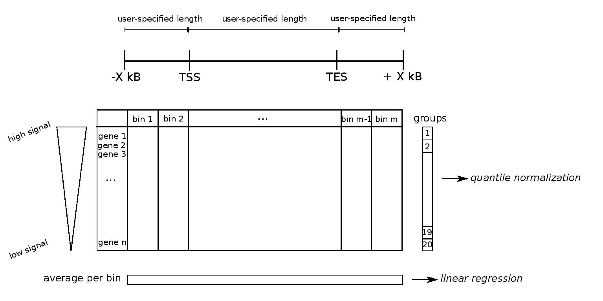
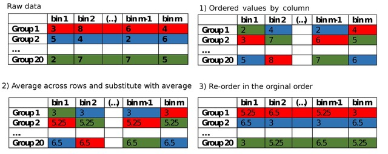
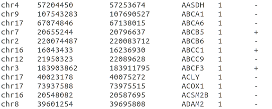
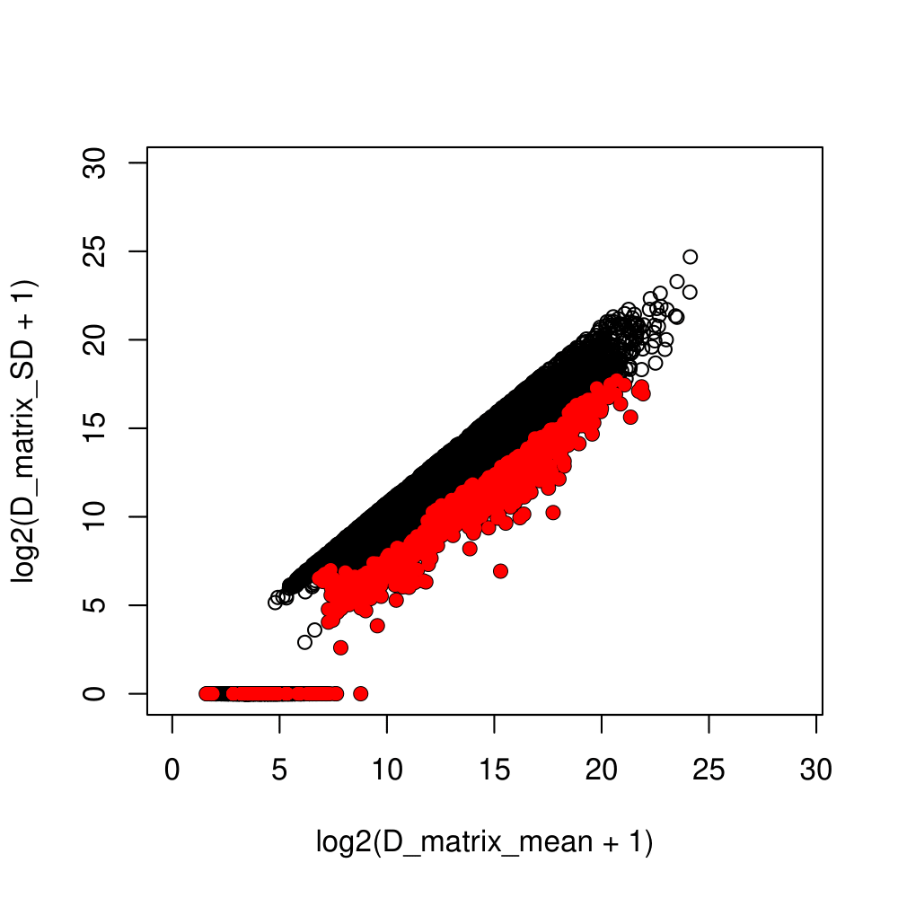
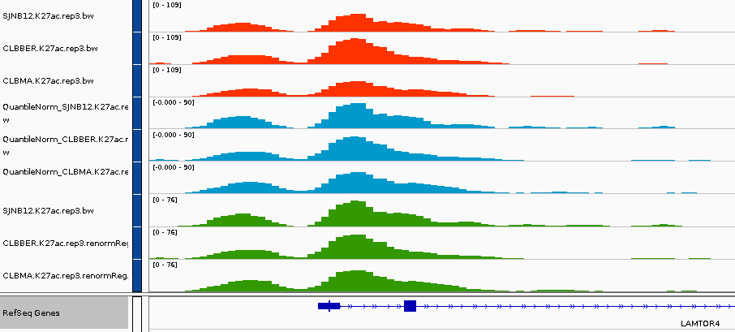
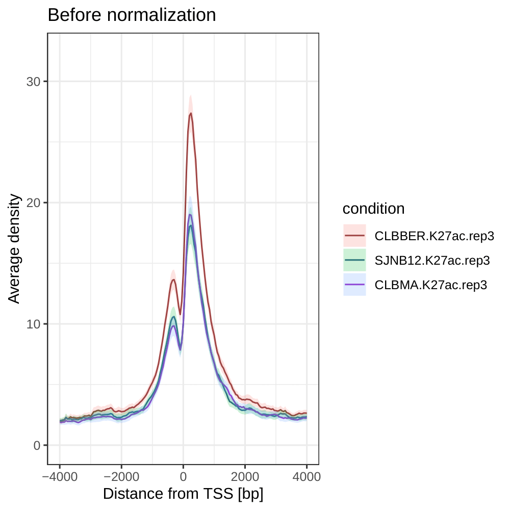
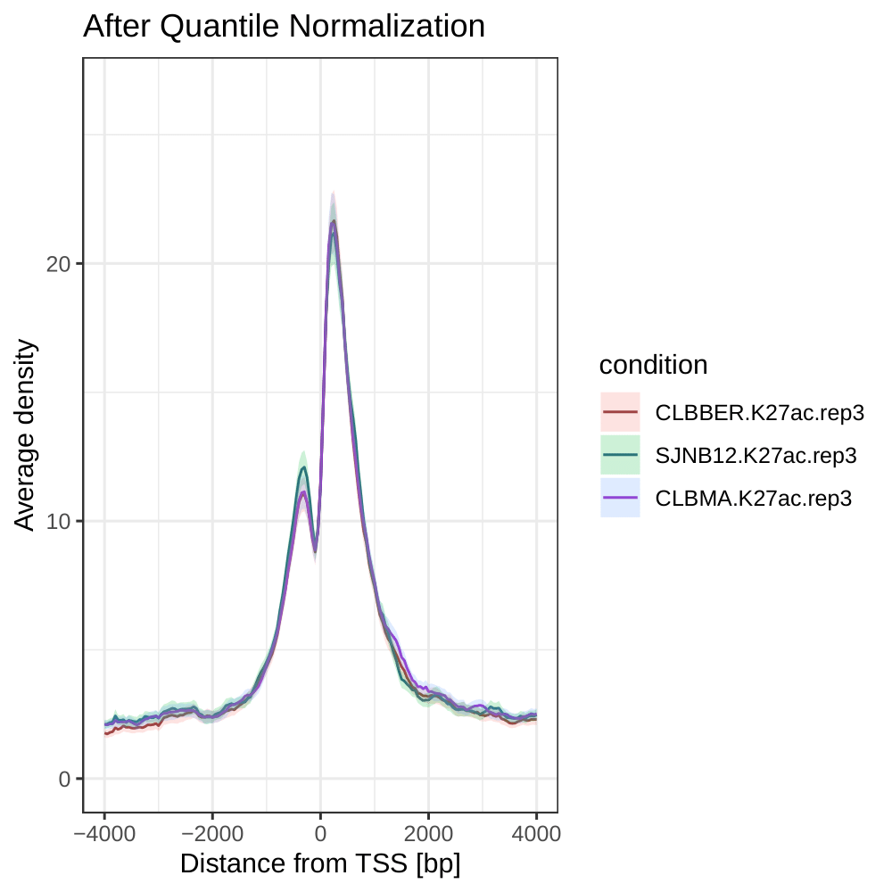
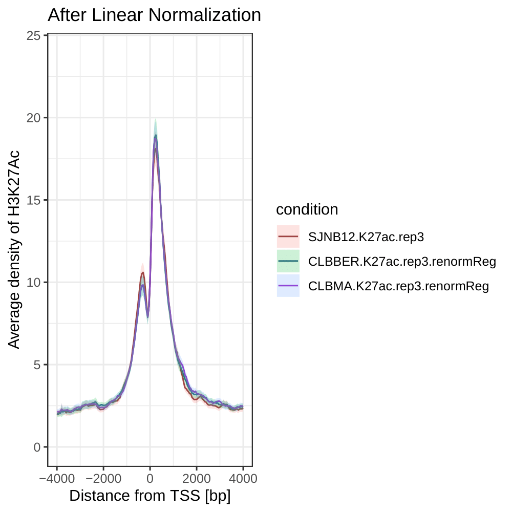
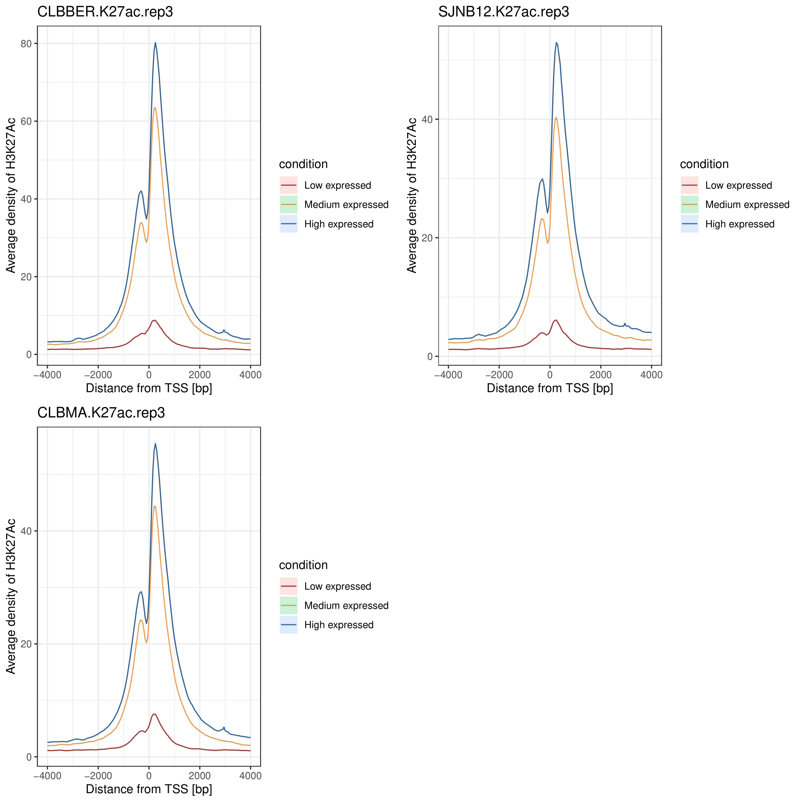

```{r, include = FALSE}
knitr::opts_chunk$set(
  collapse = TRUE,
  comment = "#>"
)
```


# Introduction

CHIPIN is an R package that provides a normalization procedure to compare signals between ChIP-seq samples in different conditions; experiments should be performed using the same antibody. CHIPIN output includes normalized density profiles and several statistics describing the characteristics of the normalization procedure. The normalization is based on the assumption that no differences in ChIP-seq signal should be observed in the regulatory regions of genes whose expression does not change across samples/conditions. Using CHIPIN, the user obtains bigWig files that can be further used to compare intensity of histone modifications or transcription factor binding at specific regions of interest between the different conditions/samples.
Moreover, CHIPIN provides a possibility to qualify the antibody used in the ChIP-seq experiments by plotting ChIP-seq signal density around gene transcription start sites for highly, medium and lowly expressed genes.


# Requirements

CHIPIN depends on the installation of "deeptools". Please see https://deeptools.readthedocs.io/en/develop/content/installation.html 


```{r setup, eval=FALSE}
library(CHIPIN)
```


# CHIPIN_normalize function

This section explains how the normalization procedure is done. To perform the normalization, use the main function: CHIPIN_normalize. All the parameters of this function are explained in the following sections. At the end of this section, there is an example of how to use this function with a test data set included in the package. There is three steps performed by the CHIPIN_normalize function:

+ Determine constant_genes
+ Perform normalization
+ Compute statistics

## Determine constant_genes

If the user provides a list of genes in bed format through a .bed file using the **path_to_file_with_constant_genes** parameter, the package uses this set of genes for the normalization. 

Otherwise, parameter **path_to_file_with_constant_genes** can be set to NULL, and CHIPIN automatically determines the set of genes whose expression levels are constant across samples/conditions automatically. In this case, one should provide RPKM or raw_read_count data. Given gene expression data (RNA-seq or microarray), the mean and the standard deviation of the Count Per Million (CPM) values for each gene across samples/conditions are determined. Ten percent of genes showing the smallest standard deviation (this percentage can be modified using the parameter **percentage**) is extracted as “constant_genes”. The output is a standard bed file that will be stored in the directory the user provides using the “output_dir” parameter. 

If the user cannot provide neither RPKM/raw_read_count data or list of "constant_genes", all genes are further used in the normalization process, even though  we do not recommend to use the package this way as it may result in improper correction.


## Perform Normalization

The normalization process starts by building a matrix containing the original binding intensities of ChIP-seq signal across “constant_genes” (regions +/- x bp surrounding the gene body, default: x=4kb) using the function “computematrix” included in the deeptools package (Ramirez et al, 2016, 2).

A matrix obtained for all samples/conditions is used to infer the normalization parameters. Two different types of normalization can be performed:

+ **Quantile normalization**
+ **Linear regression with non-zero intercept**

{width=85%}


### Quantile normalization

In order to perform quantile normalization, the parameter **type_norm** should be set to **“quantile”**. The output matrix of the function “computematrix” is sorted by rows according to the total signal value of each gene across bins. Given the ordered matrix, we build *k* groups (*k*=20 by default) corresponding to *k* different ChIP-seq signal intensities. The quantile normalization is done on the mean density values for each of these *k* groups. The main steps of the quantile normalization are explained on the following figure.


{width=85%}

### Linear normalization with non-zero intercept

For the linear normalization with non-zero intercept, the parameter **typeNorm** should be set to **“linear”**. The linear regression with non-zero intercept is performed on the average signal intensity values per bin i for a given sample versus a reference sample. The reference sample is choosen as the sample with the median total signal value among all samples. For each sample, the parameters α and β that minimize the sum of square errors are determined by the linear regression with non-zero intercept. The signal of the bigWig file for the current sample is then modified using these parameters α and β.

## Compute statistics

CHIPIN computes statistics illustrating success of the normalization process: the relative difference between average signal curves before and after the normalization. For each sample, CHIPIN computes the area under the average signal curves before the normalization around TSS of “ConstantGenes”. The sample with the highest value is selected as “reference”. Then the value of each other sample is expressed as a percentage of the “reference”. Given these values, CHIPIN computes the relative difference between all samples before normalization. After the normalization, the same process is repeated. If the normalization process worked well the relative difference between samples should decrease.

## Parameters

Common parameters for the three steps of CHIPIN_normalize function:

* **sample_name**: sample name to be used as a prefix for the different outputs. Default:"sample"
* **output_dir**: path to the output directory where one wants to store the ouput files. This directory should be created before running the function. Default: "."
* **organism**: reference genome: “hg19”, “hg38”, “mm9” or “mm10”.

To determine “constant_genes”, the mandatory parameters are:

* **TPM**: path to a gene expression file (TPM values): first column should contain gene names (official gene symbol), each following column should correspond to one sample/condition. The order of values should correspond to the order of .bigWig files in "path_to_bw". If you provide the "TPM" parameter, do not use the "raw_read_count" parameter or the "RPKM" parameter. If both "RPKM and "raw_read_count" parameters are set to NULL, and "path_to_file_with_constant_genes" is NULL too, then all genes will be used for the normalization; "expression_plot" (see below) will be set to FALSE. Default: NULL.
* **RPKM**: path to a gene expression file (RPKM values): first column should contain gene names (official gene symbol), each following column should correspond to one sample/condition. The order of values should correspond to the order of .bigWig files in "path_to_bw". RPKM values will be transformed into "raw_read_count" values using information on exon lengths; then, "raw_read_count" values will be used to determine genes whose expression does not change across all the conditions ("constant_genes"). If you provide the "RPKM" parameter, do not use the "raw_read_count" parameter or the "TPM" parameter. If both "RPKM and "raw_read_count" parameters are set to NULL, and "path_to_file_with_constant_genes" is NULL too, then all genes will be used for the normalization; "expression_plot" (see below) will be set to FALSE. Default: NULL
* **raw_read_count**: path to a gene expression file (raw read count values): first column should contain gene names (official gene symbol), each following column should correspond to one sample/condition. The order of values should correspond to the order of .bigWig files in "path_to_bw". If you provide the "raw_read_count" parameter, do not use the "RPKM" parameter or the "TPM" parameter. If both "RPKM and "raw_read_count" parameters are set to NULL, and "path_to_file_with_constant_genes" is NULL too, then all genes will be used for the normalization; "expression_plot" (see below) will be set to FALSE. Default: NULL

Optional paramaters:
* **percentage**: a value between 0 and 1 describing the percentage of the total number of genes that one wants to be defined as "constant_genes". Default: 0.1
* **path_to_file_with_constant_genes**: path to a .bed file with genes that do not change their expression across the conditions ("constant_genes"). If left emtpy (NULL), the list of constant genes will be determined automatically using either "RPKM" or "raw_read_count" values. Default:NULL

To perform normalization, the mandatory parameter is:

* **path_to_bw**: a vector containing paths to .bigWig files of the samples/conditions of interest. ! Mandatory parameter with no default value

Optional parameters:
* **type_norm**: type of normalization to perform: 'linear' or 'quantile'. Default: 'linear'
* **beforeRegionStartLength** (default: 4000), **afterRegionStartLength** (default: 4000), **regionBodyLength** (default: 40000), **binSize** (default: 10): parameters of the “computematrix” function of deeptools. They correspond to distance upstream of the reference-point selected, distance downstream of the reference-point selected, distance in bases to which all regions will be fit, and length, in bases, of the non-overlapping bins for averaging the score over the regions length, respectively. See https://deeptools.readthedocs.io/en/develop/content/tools/computeMatrix.html for more details
* **expression_plot**: boolean parameter, use "expression_plot=TRUE"" to call function “plot_expression” to plot the density signal around gene TSS. Default: FALSE
* **compute_stat**: boolean parameter, use "compute_stat=TRUE" to compute statisctics characterizing the normalization process. This statistic will be written in the "output_StatsFile.txt" file located in the output_folder and will show how much the normalization reduced the difference between the samples/conditions. Default:FALSE
* **nGroup**: number of gene groups for quantile normalisation. Default: 20
* **histone_mark**: name of the histone mark of interest; used to plot legends. Default:"ChIP-seq signal"


```
#### Usage:
CHIPIN_normalize(path_to_bw, ...)

##### Using RPKM values:
CHIPIN_normalize(path_to_bw, type_norm="linear", TPM=NULL, RPKM, raw_read_count=NULL, path_to_file_with_constant_genes=NULL, sample_name, output_dir=".", organism, beforeRegionStartLength=4000, afterRegionStartLength=4000, regionBodyLength=40000, binSize=10, expression_plot=FALSE, compute_stat=FALSE, percentage=0.1, nGroup=20, histone_mark="ChIP-seq signal")


##### Using raw read count values:
CHIPIN_normalize(path_to_bw, type_norm="linear", RPKM=NULL, raw_read_count, path_to_file_with_constant_genes=NULL, sample_name, output_dir=".", organism, beforeRegionStartLength=4000, afterRegionStartLength=4000, regionBodyLength=40000, binSize=10, expression_plot=FALSE, compute_stat=FALSE, percentage=0.1, nGroup=20, histone_mark="ChIP-seq signal")

##### Using TPM values:
CHIPIN_normalize(path_to_bw, type_norm="linear", TPM, RPKM=NULL, raw_read_count=NULL, path_to_file_with_constant_genes=NULL, sample_name, output_dir=".", organism, beforeRegionStartLength=4000, afterRegionStartLength=4000, regionBodyLength=40000, binSize=10, expression_plot=FALSE, compute_stat=FALSE, percentage=0.1, nGroup=20, histone_mark="ChIP-seq signal")

##### Using constant genes provided by the user:
CHIPIN_normalize(path_to_bw, type_norm="linear", RPKM=NULL, raw_read_count=NULL, path_to_file_with_constant_genes, sample_name, output_dir=".", organism, beforeRegionStartLength=4000, afterRegionStartLength=4000, regionBodyLength=40000, binSize=10, expression_plot=FALSE, compute_stat=FALSE, percentage=0.1, nGroup=20, histone_mark="ChIP-seq signal")


##### Using all genes (not recommended):
CHIPIN_normalize(path_to_bw, type_norm="linear", RPKM=NULL, raw_read_count=NULL, path_to_file_with_constant_genes=NULL, sample_name, output_dir=".", organism, beforeRegionStartLength=4000, afterRegionStartLength=4000, regionBodyLength=40000, binSize=10, expression_plot=FALSE, compute_stat=FALSE, percentage=0.1, nGroup=20, histone_mark="ChIP-seq signal")

```


## Example

Before running the function **CHIPIN_normalize**, create the **output_dir** directory. Default: "." 


```
#initialize parameters:
pathToRPKMfile = system.file("extdata", "FPKM_values_CLBBER_CLBMA_SJNB12.txt", package = "CHIPIN")
pathToFiles = system.file("extdata", c("CLBBER.K27ac.rep3.bw","SJNB12.K27ac.rep3.bw","CLBMA.K27ac.rep3.bw"), package = "CHIPIN")
outputFolder ="." #change it if needed; create the corresponding output folder if it does not exists
histoneMarkName = "H3K27Ac"
sampleName = "neuroblastoma"


#normalize the data without plotting the distribution around gene TSS (quantile normalization, expression_plot=FALSE):
CHIPIN_normalize(path_to_bw=pathToFiles, type_norm="quantile", RPKM=pathToRPKMfile, sample_name=sampleName, output_dir=outputFolder, organism="hg19", compute_stat=TRUE, percentage=0.1, nGroup=20, histone_mark=histoneMarkName)


#normalize the data and plot the distribution around gene TSS (linear normalization, expression_plot=TRUE):
CHIPIN_normalize(path_to_bw=pathToFiles, type_norm="linear", RPKM=pathToRPKMfile, sample_name=sampleName, output_dir=outputFolder, organism="hg19", expression_plot=TRUE, compute_stat=TRUE, histone_mark=histoneMarkName)

```

## Output files

There is 9 different types of output files: 

+ **sample_name_constant_genes.bed** is the bed file with "constant genes".

{width=50%}

+ **sample_nameCPMmeanVSsd.pdf** figure representing log2(standardDeviation(CPM)+1) function of log2(mean(CPM)+1) showing in red **"Constant genes"**.

{width=50%}
                                                                                                                                               
+ **normalized bigWig files** in case of linear regression the suffixe is "renormReg.bw", in case of quantile normalization the prefix is "QuantileNorm_".

{width=100%}


+ **.mat.gz files** are the output of computeMatrix function from deeptools.
+ **StatsAfter.txt** and **StatsBefore.txt** are text files with statistics. 
+ **After_Normalization.pdf** and **Before_Normalization.pdf** are density profiles around TSS of "Constant Genes" that show the impact of normalization.

{width=50%}

{width=50%}

{width=50%}


# plot_expression function

CHIPIN offers the possibility to profile ChIP-seq intensity around TSS as a function of gene expression level using the function plot_expression. The signal is visualized for three groups of genes obtained with k-means clustering: highly-expressed, medium-expressed and lowly-expressed genes. The results of such visualization are important to verify the efficiency of the antibody used. To use this function, several parameters are mandatory:

* **TPM**: path to a gene expression file (TPM values): first column should contain gene names (official gene symbol), each following column should correspond to one sample/condition. The order of values should correspond to the order of .bigWig files in "path_to_bw". If you provide the "TPM" parameter, do not use the "raw_read_count" parameter or the "RPKM" parameter. Default: NULL.
* **RPKM**: path to a gene expression file (RPKM values): first column should contain gene names (official gene symbol), each following column should correspond to one sample/condition. The order of values should correspond to the order of .bigWig files in "path_to_bw". If you provide the "RPKM" parameter, do not use the "raw_read_count" parameter or the "TPM" parameter. Default:NULL.
* **raw_read_count**: path to a gene expression file (raw read count values): first column should contain gene names (official gene symbol), each following column should correspond to one sample/condition. The order of values should correspond to the order of .bigWig files in "path_to_bw". Raw read count values will be transformed into RPKM values using information on exon lengths. If you provide the "raw_read_count" parameter, do not use the "RPKM" parameter or the "TPM" parameter. Default:NULL.
* **path_to_bw**: a vector containing paths to .bigWig files of the samples/conditions of interest. ! Mandatory parameter.
* **output_dir**: path to the output directory where one wants to store the ouput files. This directory should be created before running the function. Default: "."
* **organism**: is one of “hg19”, “hg38”, “mm9” or “mm10”. ! Mandatory parameter with no default value. 

One optional parameter can be set:

* **histone_mark** name of the histone mark of interest; used to plot legends. Default:"ChIP-seq signal"

```
##### using TPM values:
plot_expression(TPM, RPKM=NULL, raw_read_count=NULL, path_to_bw, output_dir=".", organism, histone_mark="ChIP-seq signal")

##### using RPKM values:
plot_expression(RPKM, raw_read_count=NULL, path_to_bw, output_dir=".", organism, histone_mark="ChIP-seq signal")

##### using raw read count values:
plot_expression(RPKM=NULL, raw_read_count, path_to_bw, output_dir=".", organism, histone_mark="ChIP-seq signal")
```

This function can be also launched directly from the **CHIPIN_normalize** function by setting the parameter **expression_plot** to TRUE.

## Example

```
#initialize parameters:
pathToRPKMfile = system.file("extdata", "FPKM_values_CLBBER_CLBMA_SJNB12.txt", package = "CHIPIN")
pathToFiles = system.file("extdata", c("CLBBER.K27ac.rep3.bw","SJNB12.K27ac.rep3.bw","CLBMA.K27ac.rep3.bw"), package = "CHIPIN")
outputFolder = "." #change it if needed; create the corresponding output folder if it does not exists
histoneMarkName = "H3K27Ac"

#run plotting function:
plot_expression(RPKM = pathToRPKMfile, path_to_bw = pathToFiles, organism="hg19", output_dir = outputFolder, histone_mark = histoneMarkName)
```


{width=90%}

